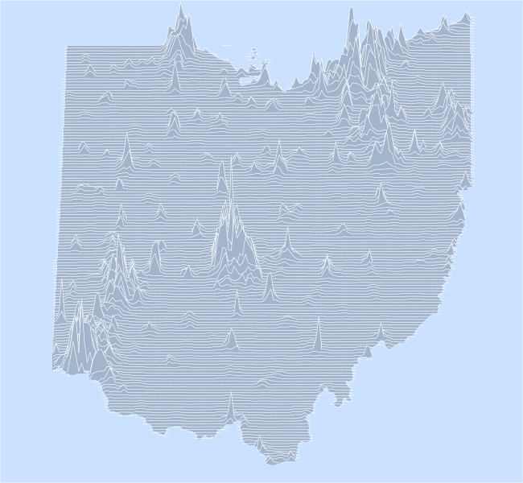

# GIS with R: how to start?

Presentation at [the GIS Learning Community](http://guides.libraries.uc.edu/GIS/GISLC), Cincinnati, 2017-11-01.

## Slides, code and data

- [The slides could be seen here.](https://cdn.rawgit.com/Nowosad/gis_with_r_how_to_start/aea08f46/gis_with_r_start.html)
- [The slides, code, and data are available here.](https://github.com/Nowosad/gis_with_r_how_to_start/archive/master.zip)
