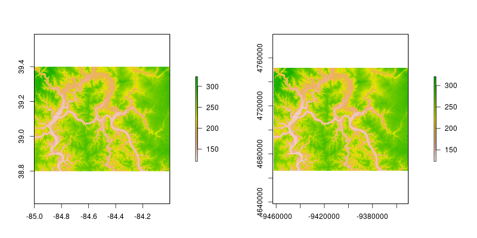

class: inverse, center, middle
```{r setup, include=FALSE}
options(htmltools.dir.version = FALSE)
knitr::opts_chunk$set(fig.align = 'center', warning = FALSE, message = FALSE)
```

# Part I - Examples

---
- Static visualization (1-2)
- RasterVis spatiotemporal
- Animation
- Interactive visualization
- https://hafen.github.io/geofacet/
- Shiny
- Combining data from different sources (merge raster + reprojection)
- Interpolation
- Raster calculations
- Stats

---
# Part II - An intro to R

---
## 

- What's R
- How to get R
- Rstudio
- How to get help?
- Concept of packages (and how to get them)

<!-- In preparation for the course you should: -->

<!--     Ensure that you have the latest versions of R and RStudio installed on your laptop: https://www.rstudio.com/products/rstudio/download/ -->
<!--     Brush up on your R skills if you're not an R user, e.g. with: -->
<!--         This excellent tutorial that you can work through to get used to the interface: https://www.datacamp.com/courses/free-introduction-to-r -->
<!--         A more detailed account by Gillespie and Lovelace (2017): https://csgillespie.github.io/efficientR/set-up.html#rstudio -->
<!--     Take a look at how GitHub works - we'll be using it for sharing course materials and sharing links and examples during the course, e.g. by reading this page (and following the tutorial if really keen): https://guides.github.com/activities/hello-world/ -->


---
# Part III - An intro to spatial R

<!-- The course will be based on Chapter 4 of Geocomputation with R of the forthcoming book Geocomputation with R -->

---
## AAA

- sf and sp are the most important R packages to handle vector data; sf is a successor of sp, but it's still evolving. Moreover, many other R packages depend on the functions and classes for the sp package
- raster is an extension of spatial data classes to work with rasters
- there are many ways to vizualize spatial data in R, for example ggplot2, rasterVis, tmap, leaflet, and mapview packages
- it is easy to connect R with a GIS software - GRASS GIS (rgrass7), SAGA (RSAGA), QGIS (RQGIS), and ArcGIS (arcgisbinding)

---
## Spatial operations

It's a big topic which includes:

Spatial subsetting
Spatial joining/aggregation
Topological relations
Distances
Spatial geometry modification
Raster operations (map algebra)

---
## The **sf** package

The **sf** package in an R implementation of [Simple Features](https://en.wikipedia.org/wiki/Simple_Features). This package incorporates:
- a new spatial data class system in R
- functions for reading and writing data
- tools for spatial operations on vectors

Most of the functions in this package starts with prefix `st_`.

```{r, eval=FALSE}
devtools::install_github('edzer/sfr') # development version
```

or

```{r, eval=FALSE}
install.packages('sf') # stable version
```

You need a recent version of the GDAL, GEOS, Proj.4, and UDUNITS libraries installed for this to work on Mac and Linux. More information on that at https://github.com/edzer/sfr.

```{r, message=FALSE}
library('sf')
```

---
## Reading spatial data

```{r}
wrld <- st_read('data/wrld.shp')
```

```{r}
ham <- st_read('data/hamilton_county.gpkg')
```

---
## Reading spatial data - text files

```{r}
ham_cities <- read.csv('data/hamiltion_cities.csv')
```

```{r}
ham_cities_sf <- st_as_sf(ham_cities, coords = c("X","Y"))
ham_cities_sf
```

---
## Writing spatial data

```{r, warning=FALSE, results='hide', echo=FALSE}
file.remove(c('data/new_wrld.shp', 'data/new_wrld.gpkg'))
```

```{r, warning=FALSE}
st_write(wrld, 'data/new_wrld.shp')
```

```{r, warning=FALSE}
st_write(wrld, 'data/new_wrld.gpkg')
```

```{r, warning=FALSE, results='hide', echo=FALSE}
file.remove(c('data/new_wrld.shp', 'data/new_wrld.gpkg'))
```

---
## **sf** structure

**sf** objects usually have two classes - `sf` and `data.frame`. Two main differences comparing to a regular `data.frame` object are spatial metadata (`geometry type`, `dimension`, `bbox`, `epsg (SRID)`, `proj4string`) and additional column - typically named `geom` or `geometry`.

```{r}
wrld[1:2, 1:3]
```

---
## Attributes - the **dplyr** package

- It also easy to use the **dplyr** package on `sf` objects:

```{r, message=FALSE}
library('dplyr')
```

---
## Attributes - the **dplyr** package

- `filter()`:

```{r}
wrld_fil <- filter(wrld, pop < 297517)
```

```{r, echo=FALSE}
wrld_fil[1:3, ]
```

---
## Attributes - the **dplyr** package

- `mutate()`:

```{r}
wrld_mut <- mutate(wrld, pop_density = pop/area_km2)
```

```{r, echo=FALSE}
wrld_mut[1:3, ]
```

---
## Attributes - the **dplyr** package

- `summarize()`:

```{r}
wrld_sum1 <- summarize(wrld, pop_sum = sum(pop, na.rm = TRUE), 
                      pop_mean = mean(pop, na.rm = TRUE), 
                      pop_median = median(pop, na.rm = TRUE))
```

```{r, echo=FALSE}
wrld_sum1[1, ]
```

```{r}
wrld_sum1 <- wrld %>% 
        group_by(continent) %>% 
        summarize(pop_sum = sum(pop, na.rm = TRUE), 
                      pop_mean = mean(pop, na.rm = TRUE), 
                      pop_median = median(pop, na.rm = TRUE))
```

```{r, echo=FALSE}
wrld_sum1[1:3, ]
```

---
## CRS 

```{r}
st_crs(ham_cities_sf)
```

---
## Reprojection

- The `st_transform()` can be used to transform coordinates

```{r}
wrld_3410 <- st_transform(wrld, 3410)
st_crs(wrld_3410)
```

```{r,echo=FALSE, eval=FALSE}
png('figs/coord_compare.png', width = 1000, height = 250)
par(mfrow = c(1, 2), mar=c(0,0,0,0))
plot(wrld_3410[0]);plot(wrld[0])
dev.off()
```


---
## Basic maps

- Basic maps of `sf` object can be quickly created using the `plot()` function:

```{r, eval=FALSE}
plot(wrld[0])
```

```{r, eval=FALSE}
plot(wrld["pop"])
```

```{r, eval=FALSE, echo=FALSE, message=FALSE, warning=FALSE, results='hide'}
png('figs/plot_compare.png', width = 800, height = 300)
par(mfrow = c(1, 2), mar=c(0,0,1,0))
plot(wrld[0]);plot(wrld["pop"])
dev.off()
```


---
class: inverse, center, middle
## Raster data

```{r, include=FALSE, eval=FALSE}
library('raster')
# getData('SRTM', lon=-8, lat=45, path='data')
# getData('SRTM', lon=-8, lat=40, path='data')
# dem <- raster('data/srtm_35_04.tif')
# system.time(plot(dem))
# system.time(image(dem))
# system.time(rasterVis::levelplot(dem))
# getData('SRTM', lon=-85, lat=40, path='data')
library('tigris')
library('sf')
library('tidyverse')
oh <- counties(state='OH')
ham <- oh %>% 
        st_as_sf(.) %>% 
        filter(NAME=='Hamilton')
plot(ham[0])
ham %>% st_write(., 'data/hamilton_county.gpkg')

dem <- raster('data/srtm_20_05.tif')


dem2 <- crop(dem, extent(-85, -84, 38.8, 39.4))
writeRaster(dem2, 'data/srtm.tif')
plot(dem2)
plot(ham, add = TRUE)
```

---
## The **raster** package

The **raster** package consists of method and classes for raster processing. It allows to:

- read and write raster data
- perform raster algebra and raster manipulations
- work on large datasets due to its ability to process data in chunks
- visualize raster data
- many more...

This package has three object classes:

- `RasterLayer` - for single-layer objects
- `RasterStack` - for multi-layer objects from separate files or a few layers from a single file
- `RasterBrick` - for multi-layer objects linked to a single file

```{r, message=FALSE}
library('raster')
```

---
## Reading

```{r}
dem <- raster('data/srtm.tif')
dem
```

---
## Writing

```{r, warning=FALSE, results='hide', echo=FALSE}
file.remove(c('data/new_dem.tif', 'data/new_dem2.tif'))
```

```{r}
writeRaster(dem, 'data/new_dem.tif')
```


```{r}
writeRaster(dem, 'data/new_dem2.tif', 
            datatype = 'FLT4S', options=c("COMPRESS=DEFLATE"))
```

```{r, warning=FALSE, results='hide', echo=FALSE}
file.remove(c('data/new_dem.tif', 'data/new_dem2.tif'))
```

```{r}
writeFormats()
```

---
## **raster** structure

```{r}
dem
```

```{r}
inMemory(dem)
```

---
## Attributes

- the `getValues` function returns values from a raster object:

```{r}
values_dem <- getValues(dem)
```

```{r, echo=FALSE}
values_dem[1:50]
```

---
## Attributes

.pull-left[
```{r}
new_dem <- dem + 50
```

```{r, fig.align='center', fig.height=5, echo=FALSE}
plot(new_dem)
```
]

.pull-right[
```{r}
new_dem2 <- dem * new_dem
```

```{r, fig.align='center', fig.height=5, echo=FALSE}
plot(new_dem2)
```
]

---
## CRS 

```{r}
crs(dem)
```

---
## Reprojection

```{r}
dem3410 <- projectRaster(dem, crs="+proj=cea +lon_0=0 +lat_ts=30 +x_0=0 +y_0=0 +a=6371228 +b=6371228 +units=m +no_defs")
```

```{r,echo=FALSE, eval=FALSE}
png('figs/coord_compare_raster.png', width = 800, height = 400)
par(mfrow = c(1, 2), mar=c(4,4,4,8))
# par(mfrow = c(1, 2))
plot(dem);plot(dem3410)
dev.off()
```



---
## Simple map

```{r, fig.align='center'}
plot(dem)
```

---
class: inverse, center, middle
## Vector-Raster interactions

---
## Extract

```{r}
ham_cities_sp <- as(ham_cities_sf, 'Spatial')
raster::extract(dem, ham_cities_sp)
```

```{r}
ham_cities_sf$dem <- raster::extract(dem, ham_cities_sp)
ham_cities_sf
```

---
## Crop

```{r, echo=FALSE, message=FALSE, cache=TRUE}
library('tigris')
oh <- counties(state='OH')
ham0 <- oh %>% 
        st_as_sf(.) %>% 
        filter(NAME=='Hamilton')
ham <- st_transform(ham0, 4326)
```

```{r}
ham84 <- st_transform(ham, 4326)
ham_sp <- as(ham84, 'Spatial')
```

.pull-left[ 
```{r}
dem_crop <- crop(dem, ham_sp)
```

```{r, echo=FALSE}
plot(dem_crop)
```
]

.pull-right[ 
```{r}
dem_mask <- mask(dem_crop, ham_sp)
```

```{r, echo=FALSE}
plot(dem_mask)
```
]

---
class: inverse, center, middle
## Advanced map-making

---
## rasterVis

- https://oscarperpinan.github.io/rastervis/
- http://www.colorbrewer.org

```{r, message=FALSE, fig.align='center', fig.height=4}
library('rasterVis')
my_theme <- rasterTheme(region=brewer.pal('RdYlGn', n = 9))
p <- levelplot(dem_crop, margin = FALSE, par.settings = my_theme)
p <- p + layer(sp.lines(ham_sp, lwd = 3, col = 'darkgrey'))
p + layer(sp.points(ham_cities_sp, pch = 19, col = 'black'))
```

---
## tmap

- https://cran.r-project.org/web/packages/tmap/vignettes/tmap-nutshell.html

```{r, fig.align='center', fig.height=4}
library('tmap')
tm_shape(wrld, projection="wintri") +
        tm_polygons("lifeExp", style="pretty", palette="RdYlGn",
                    auto.palette.mapping=FALSE, title=c("Life expactancy")) +
        tm_style_grey()
```

---
## leaflet

```{r, eval=FALSE}
library('leaflet')
leaflet(ham_sp) %>%
        addProviderTiles(providers$Stamen.Watercolor) %>% 
        # addTiles() %>%
        addPolygons() %>% 
        addMarkers(data=ham_cities_sp, popup=~as.character(name))
```

```{r, echo=FALSE, message=FALSE}
library(widgetframe)
library('leaflet')
l <- leaflet(ham_sp) %>%
        addProviderTiles(providers$Stamen.Watercolor) %>% 
        # addTiles() %>%
        addPolygons() %>% 
        addMarkers(data=ham_cities_sp, popup=~as.character(name))
frameWidget(l, height = '400')
```

---
# Part IV - Examples

- Explained code from the start

---
## Geocomputation with R

The online version of the book is at http://robinlovelace.net/geocompr/ and its source code at https://github.com/robinlovelace/geocompr.

We encourage contributions on any part of the book, including:

- Improvements to the text, e.g. clarifying unclear sentences, fixing typos (see guidance from [Yihui Xie](https://yihui.name/en/2013/06/fix-typo-in-documentation/))
- Changes to the code, e.g. to do things in a more efficient way
- Suggestions on content (see the project's [issue tracker](https://github.com/Robinlovelace/geocompr/issues) and the [work-in-progress](https://github.com/Robinlovelace/geocompr/tree/master/work-in-progress) folder for chapters in the pipeline)

Please see [our_style.md](https://github.com/Robinlovelace/geocompr/blob/master/our_style.md) for the book's style.


---
# References

Lovelace, R., Nowosad, J., Meunchow, J., 2018. Geocomputation with R. CRC Press.
